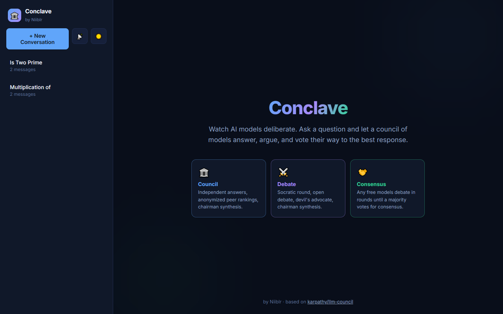
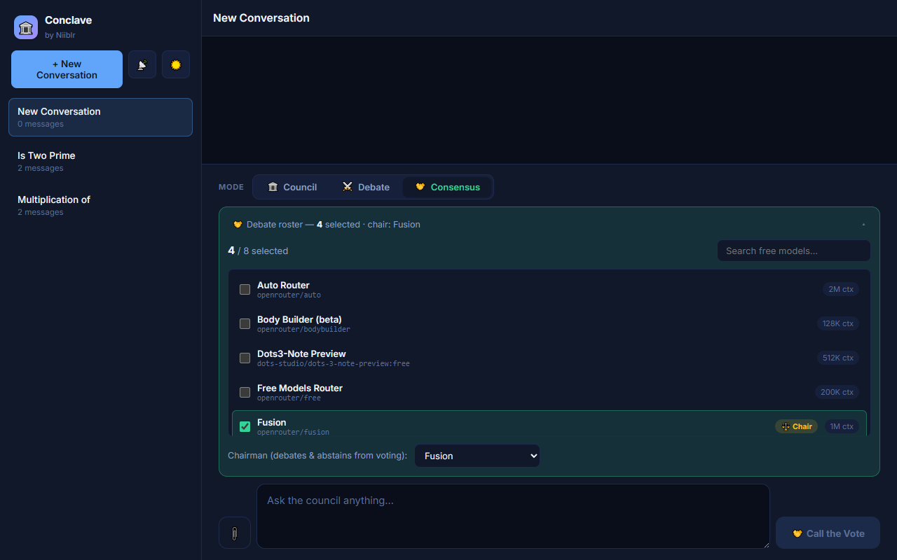
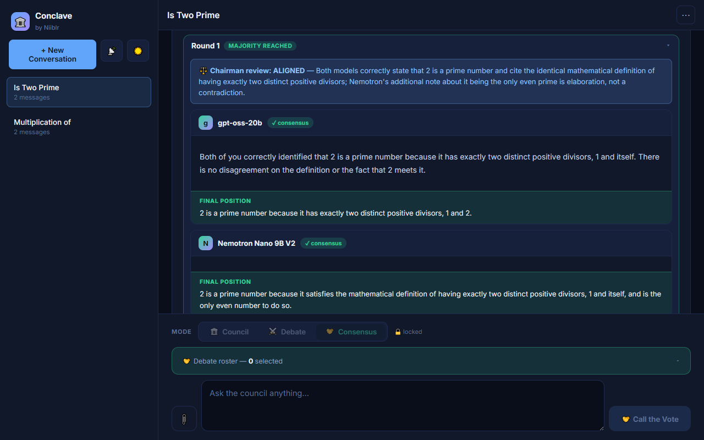
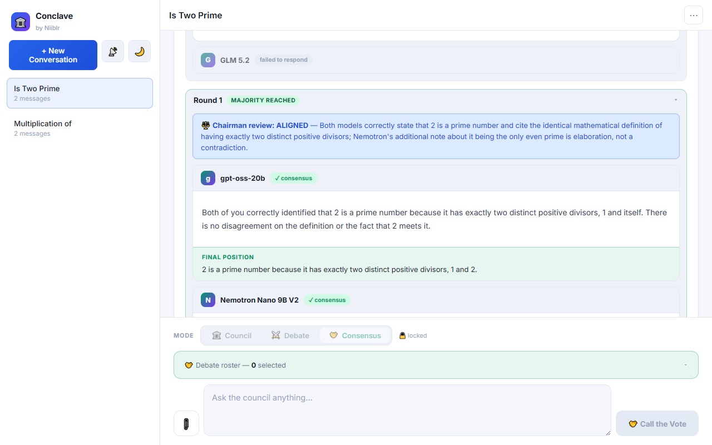

# Conclave

### by Niiblr


> *Multiple AIs walk into a room.*

A multi-LLM debate engine. Mix local Ollama, Gemini, OpenAI, and OpenRouter models in one council. Ask a question or upload a document, watch them debate it across multiple phases, get a synthesized answer.

Originally inspired by [Andrej Karpathy's llm-council](https://github.com/karpathy/llm-council), which sends a question to multiple LLMs, has them rank each other, and synthesizes an answer. Conclave keeps that core idea and builds on it: a four-phase debate mode, voting-round consensus debates between free models, file upload, persistent conversations, streaming, dark & light themes, and a fully self-contained HTML export.



---

## Quick Start

Already comfortable with the command line? This is all it takes:

```bash
git clone https://github.com/Niiblr/conclave.git
cd conclave
uv sync                                   # backend deps
cd frontend && npm install && cd ..       # frontend deps
./start.sh                                # starts backend :8001 + frontend :5173
```

Create a `.env` from `.env.example` and add your `OPENROUTER_API_KEY` — that alone is enough for **Consensus mode**, since its models are all free. Then open <http://localhost:5173>.

Detailed walkthrough for beginners, model configuration, and local Ollama setup: see [Setup](#setup) below.

---

## What's New vs the Original

| Feature | karpathy/llm-council | Conclave |
| --- | --- | --- |
| Providers | OpenRouter only | OpenRouter, Ollama (local + cloud), Gemini, OpenAI |
| Response delivery | Wait for everything | Streaming, results appear phase by phase |
| Council mode | 3-stage (original) | Preserved with minor UI changes |
| Debate mode | None | 4-phase: Socratic, Debate, Devil's Advocate, Synthesis |
| Consensus mode | None | Free models debate in voting rounds until a majority agrees |
| Dynamic free-model roster | None | Discovers every currently-free OpenRouter model live from the models.dev catalog |
| File upload | None | PDF, DOCX, XLSX, TXT, code, markdown |
| Conversation history | None | Persistent, sidebar, rename/clear/delete |
| Model connectivity test | None | Ping all configured models, see latency |
| Export | None | Markdown or self-contained interactive HTML |
| UI | Functional | Redesigned: dark & light themes, unified composer, live progress rail |

---

## Three Modes

### Council Mode (the original Karpathy flow)

1. **Stage 1**: All models answer independently
2. **Stage 2**: Models read anonymized versions of each other's answers and rank them
3. **Stage 3**: The Chairman synthesizes a final answer from the responses and the parsed rankings

### Debate Mode

A more conversational four-phase process:

1. **Phase 1, Socratic**: All models form their initial answer
2. **Phase 2, Debate**: Each model reads the others' answers and is explicitly told it's fine to strongly disagree. Agreements, disagreements, and gaps get surfaced.
3. **Phase 3, Devil's Advocate**: A separate model (excluded from Phases 1 and 2 so it arrives fresh) identifies the emerging consensus and argues against it as forcefully as it can.
4. **Phase 4, Synthesis**: The Chairman delivers a final answer informed by Phases 2 and 3.

The Chairman and Devil's Advocate are deliberately isolated from the council to avoid them judging or reinforcing their own output.

### Consensus Mode

A debate that runs until the models actually agree — using only models that cost nothing.

1. **Pick your roster**: Conclave fetches the [models.dev](https://models.dev) catalog and lists every currently-free OpenRouter chat model (~24 at any given time). Pick 3–8 participants and designate one as the non-voting Chairman.
2. **Opening statements**: every model drafts its initial position in parallel.
3. **Debate rounds**: each model reads the full transcript (identities visible), argues, refines, and ends with a structured vote: `CONSENSUS: YES` or `NO`, plus its current final position.
4. **Majority rules**: a strict majority of YES votes ends the debate. The Chairman then verifies the majority's positions genuinely align — if they conflict, a reconciliation round is forced.
5. **Synthesis**: the Chairman delivers the council's shared final answer, noting any dissent honestly.

Pick your roster from every currently-free OpenRouter model, with context sizes and a non-voting Chairman:



Then watch the debate live — statements stream in one by one, each round ends with a vote tally, and the Chairman verifies alignment before delivering the consensus:



Conclave ships in dark and light themes:



Free-tier endpoints are flaky, so Consensus mode expects trouble. Models that fail twice are silently dropped from the roster (shown as "failed to respond"), the debate continues with whatever quorum remains, and if the designated Chairman's endpoint dies mid-debate another healthy participant steps in as an *(acting)* chairman.

> Just want to try Consensus mode? `OPENROUTER_API_KEY` alone is enough — the OpenRouter free tier costs nothing.

---

## File Upload

Drop a file into the chat and the council debates it.

**Supported types**: PDF, DOCX, XLSX, XLS, TXT, MD, PY, SH. Up to 20 MB.

The backend extracts plain text (PyPDF, python-docx, openpyxl, etc.), prepends it to your message as `[File: filename]`, and the result becomes the question every model sees. Files are never written to disk. Works in all three modes, with no separate "summarize this" path: whatever you ask, the council debates with the file as context.

---

## Conversation History

Every conversation is saved as JSON in `data/conversations/`. The sidebar shows all past conversations sorted newest first, with message counts. Rename, clear messages, or delete entirely.

Once a conversation has its first reply, the mode toggle locks. New conversations stay unlocked until they get a response.

---

## Setup

### 1. Install dependencies

**Backend:**
```
uv sync
```

**Frontend:**
```
cd frontend
npm install
cd ..
```

### 2. Configure API keys

Create a `.env` file in the project root with whichever providers you intend to use:

```
OPENROUTER_API_KEY=sk-or-v1-...
GOOGLE_API_KEY=...
OPENAI_API_KEY=...
```

You only need keys for the providers you actually call. Ollama (local or cloud) needs no key here: Ollama itself handles auth via its own config. For Consensus mode, `OPENROUTER_API_KEY` alone is enough.

### 3. Configure models

Edit `backend/config.py`. Each council member needs `provider`, `model`, and `name`:

```python
COUNCIL_MODELS = [
    {
        "provider": gemini,
        "model": "gemini-3-flash",
        "name": "Gemini 3 Flash"
    },
    {
        "provider": ollama,
        "model": "kimi-k2-thinking:cloud",
        "name": "Kimi K2 Thinking"
    },
    {
        "provider": openrouter,
        "model": "arcee-ai/arcee-spotlight:free",
        "name": "Arcee Spotlight"
    },
]

CHAIRMAN_CONFIG = {
    "provider": ollama,
    "model": "deepseek-v3.1:671b-cloud",
    "name": "DeepSeek V3.1 671B"
}

DEVILS_ADVOCATE_CONFIG = {
    "provider": ollama,
    "model": "kimi-k2-thinking:cloud",
    "name": "Kimi K2 Thinking"
}
```

Verify model IDs against each provider's current list before running. Provider routing is automatic: anything with a `:cloud` suffix goes to Ollama's cloud infrastructure, anything else runs locally.

> Consensus Mode skips `config.py` entirely — its participants come from the live free-model roster you pick in the UI at send time.

---

## Mixing Providers

A council can freely mix:

- **Cloud models via OpenRouter**, one API key gets you GPT, Claude, Gemini, Grok, and others
- **Direct API keys** for Gemini or OpenAI when you want to skip OpenRouter
- **Ollama Cloud models** for large hosted models (Kimi K2 Thinking, DeepSeek V3.1 671B, GPT-OSS 120B, Qwen3 80B, GLM-5, etc.)
- **Ollama local models** running entirely on your machine

A council of a local Llama on your PC, a cloud Gemini via direct API, and a GPT model via OpenRouter is a perfectly valid setup.

### Setting up local models with Ollama

1. Install Ollama from <https://ollama.com>
2. Pull any model:
```
   ollama pull llama3
   ollama pull mistral
   ollama pull gemma3
```
3. Add it to your council in `backend/config.py`:
```python
   {
       "provider": ollama,
       "model": "llama3",
       "name": "Llama 3 (Local)"
   }
```

### RAM requirements for local models

| Model size | Minimum RAM |
| --- | --- |
| 7B | 8GB |
| 13B | 16GB |
| 34B | 32GB |
| 70B+ | 64GB+, not recommended |

Local models are slower but completely private. Nothing leaves your machine.

---

## Running the App

**Terminal 1, backend:**
```
cd backend
uv run python -m backend.main
```

**Terminal 2, frontend:**
```
cd frontend
npm run dev
```

Or just run `./start.sh` from the repo root, which starts both and traps Ctrl+C to stop both cleanly.

Open <http://localhost:5173> in your browser.

---

## Test Your Models

The "Test Models" button in the sidebar pings every configured model in parallel (council, Chairman, Devil's Advocate, deduplicated) and shows status and latency for each. Useful for catching a misnamed model ID or a dead provider before you start a debate.

---

## Export

Once a conversation has at least one reply, two export options appear:

- **Markdown**: a clean `.md` of the full conversation, including all stages, phases, or consensus rounds
- **HTML**: a self-contained interactive page with embedded CSS, tabbed views for multi-model phases, color-coded blocks for synthesis and rankings. No external dependencies, just open it in a browser.

Both handle all three modes.

---

## Staying Up to Date

```
git pull origin main
```

Changelog: [CHANGELOG.md](./CHANGELOG.md)

---

## Tech Stack

- **Backend**: FastAPI, fully async, four provider classes hitting each LLM API directly via httpx (no SDK dependencies)
- **Frontend**: React + Vite, SSE streaming, ReactMarkdown
- **Storage**: JSON files in `data/conversations/`
- **Package management**: uv (Python), npm (JavaScript)

---

## Credits

Based on [karpathy/llm-council](https://github.com/karpathy/llm-council) by Andrej Karpathy, who built the original 3-stage council concept and explicitly invited the community to take it further. This is Niiblr's attempt at doing exactly that.

*Niiblr is a personal handle. Unlikely affiliation with the Futurama character.*
